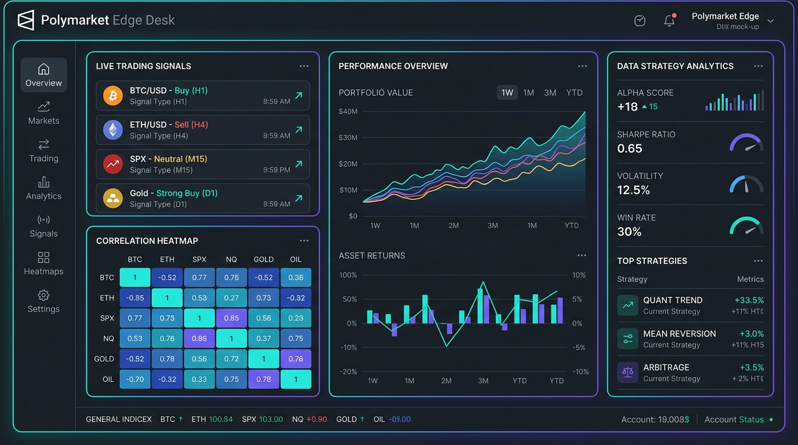

# Polymarket Scanner Bot

**Polymarket Edge Desk** is a professional-grade TypeScript trading terminal, scanner, and execution bot designed to exploit mathematical pricing inefficiencies and high-probability setups on Polymarket's decentralized prediction markets. The bot automates the identification and execution of near-zero YES contract yield harvesting and mutually exclusive negative risk basket arbitrage.



The bot is paper-only by default. It reads public Gamma/CLOB data, generates signals, and builds trade intents. Live order submission requires explicit env gates and CLOB credentials.

---

## Strategic Core & Profit Mechanics

### 1. Near-Zero YES Shorting (`near_zero_yes`)
* **The Opportunity**: Retail traders often buy low-probability "lottery ticket" YES contracts (e.g., a candidate winning an election who is mathematically out of the race) pushing the YES price to a small amount (like $0.01 or $0.02).
* **The Trade**: The bot sells (shorts) these YES contracts (or buys the NO proxy token). 
* **Profit Scenario**: If the outcome resolves to **NO** (highly likely), the YES contract settles to $0.00. The bot keeps the entire entry price ($0.01 - $0.02 per share) as profit. By shorting multiple unrelated near-zero contracts, the trader harvests high-probability yield with a very wide statistical margin of safety.

### 2. Mutually Exclusive Basket Arbitrage (`neg_risk_sell_basket`)
* **The Opportunity**: In markets where **exactly one outcome can resolve YES** (e.g., "Which team will win the NBA Championship?"), the sum of all outcomes' final prices must equal exactly $1.00. However, during active trading, retail bidding can push the sum of the best bids of all outcomes above $1.00 + edge (e.g., $1.06).
* **The Trade**: The bot places simultaneous sell limit orders on the YES contracts of all outcomes in the group (or buys NO proxy tokens proportionally).
* **Profit Scenario**: Because only one team can win, exactly one contract settles to $1.00 and all others settle to $0.00. The total payout required is exactly $1.00. Since we sold the basket for $1.06, we pocket the $0.06 difference per share as **risk-free mathematical arbitrage**, regardless of who wins the tournament.

---

## Key Features

- **Gamma API Scanning**: Scans active Polymarket events directly by category tag.
- **CLOB Order Book Depth**: Fetches live order book state for YES/NO tokens to ensure sufficient execution depth.
- **Risk Control Engine**: Builds trade intents with configurable limits (max slippage, cap on total settlement risk per asset).
- **Telegram & Desktop Notifications**: Anomaly alerts pushed directly to Telegram or as native OS notifications.
- **Strategy Backtesting**: Built-in Monte Carlo simulation module to backtest returns and chart equity curves directly in the UI.
- **Exclusion Heatmaps**: Color-coded correlation matrices showing price relationships and exclusion intensities inside leg groups.

## Setup

```bash
npm install
cp .env.example .env
```

Run a read-only scan:

```bash
npm run scan
```

Run the loop in paper mode:

```bash
npm run bot
```

Run the local web UI:

```bash
npm run ui
```

Then open `http://localhost:5173`.

Run once in bot mode:

```bash
RUN_ONCE=true npm run bot
```

On PowerShell:

```powershell
$env:RUN_ONCE="true"; npm run bot
```

## Important Env Vars

- `SPORTS_ONLY=true` filters toward sports markets.
- `NEAR_ZERO_YES_MAX_BID=0.02` means YES bids at or below 2%.
- `CORRELATION_EDGE_MIN=0.04` requires basket bid sum above 1.04.
- `MAX_SETTLEMENT_RISK_USD=5` caps SELL YES settlement exposure per order.
- `EXECUTION_STYLE=sell_yes` places SELL orders on YES tokens.
- `EXECUTION_STYLE=buy_no_proxy` buys NO tokens instead, which is the cash-funded proxy for short YES exposure.
- `EXECUTE_BASKETS=false` keeps multi-leg basket arb signals from auto-submitting by default.

## Live Trading

Live trading requires all of this:

```env
BOT_MODE=live
LIVE_TRADING=true
CONFIRM_LIVE_TRADING=I_ACCEPT_THE_RISK
PRIVATE_KEY=0x...
POLYMARKET_API_KEY=...
POLYMARKET_API_SECRET=...
POLYMARKET_API_PASSPHRASE=...
```

By default, `SELL_YES_REQUIRES_INVENTORY=true`. That means live SELL YES orders are skipped unless the wallet already has enough YES conditional-token balance. To create short-YES exposure from cash, use `EXECUTION_STYLE=buy_no_proxy`.

Use this only where Polymarket trading is legal and permitted for your account. This code does not bypass regional, account, compliance, or market restrictions.

## Verification

```bash
npm run typecheck
npm run test
```

## License

This project is licensed under the MIT License - see the [LICENSE](LICENSE) file for details.

